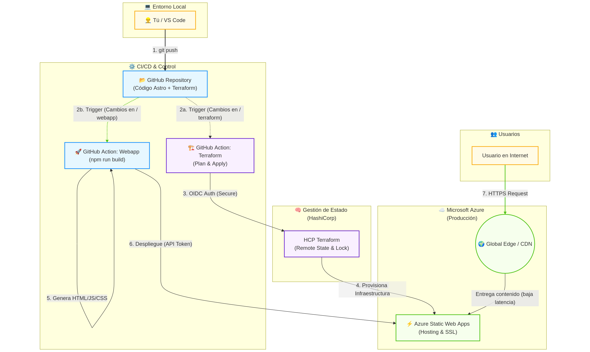

# ☁️ Cloud & DevOps Portfolio - Ivelin Apostolov


> **Una demostración práctica de ingeniería moderna en la nube:** Portafolio personal desplegado como solución Serverless en Azure, con infraestructura gestionada como código (IaC) y automatización completa.

**🌐 Live Demo:** [www.ivelinapostolov.com](https://www.ivelinapostolov.com)

---

## 📸 Vista Previa

| Arquitectura Cloud | Landing Page |
|:---:|:---:|
|  |  |
| *Diseño Serverless & GitOps* | *Astro + Tailwind CSS* |

---

## 💡 Sobre el Proyecto

Este repositorio no contiene solo el código fuente de mi página web personal. Es un caso de estudio sobre cómo implementar un ciclo de vida de desarrollo de software profesional y seguro utilizando el **Free Tier de Azure**.

El objetivo principal fue eliminar la configuración manual ("ClickOps") y separar claramente la gestión de la infraestructura del despliegue de la aplicación mediante flujos automatizados.

### Características Clave

* **Infraestructura como Código (IaC):** Todos los recursos (Grupo de recursos, Web App, Dominios) están definidos y versionados en código con Terraform.
* **Gestión de Estado Remota y Automatizada:** Uso de **HCP Terraform** vinculado directamente al repositorio. Terraform vigila la carpeta `terraform/` y, al detectar cambios, planifica y ejecuta automáticamente la actualización en Azure.
* **Despliegue de Aplicación Seguro:** La autenticación entre GitHub Actions y Azure se realiza mediante el **Deployment Token** nativo, almacenado encriptado en los Secretos de GitHub.
* **Rendimiento Global:** Distribución de contenido estático mediante la **CDN de Azure Static Web Apps**, asegurando baja latencia global.
* **Separación de Responsabilidades:** Arquitectura de monorepositorio con pipelines independientes para Infraestructura y Aplicación.

---

## 🛠️ Stack Tecnológico

### Infraestructura & DevOps
* ☁️ **Cloud Provider:** Microsoft Azure (Static Web Apps).
* 🏗️ **IaC:** Terraform (HCL).
* 🤖 **Plataforma de Infraestructura:** HCP Terraform (Version Control Workflow).
* ⚙️ **CI/CD App:** GitHub Actions.
* 🌐 **DNS:** Configuración automatizada de dominios personalizados (CNAME).

### Aplicación Web (Frontend)
* 🚀 **Framework:** Astro (Generación de sitio estático - SSG).
* 🎨 **Estilos:** Tailwind CSS.
* 📦 **Runtime Build:** Node.js.

---

## 📂 Estructura del Repositorio

El proyecto sigue una estructura de monorepositorio organizada para separar la lógica de la nube de la lógica de la web:

```text
.
├── .github/workflows/   # Pipeline de despliegue de la Web
│   └── main.yml         # Construye Astro y sube el contenido a Azure usando el API Token
├── terraform/           # Definición de Infraestructura (IaC)
│   ├── main.tf          # Recursos Azure (RG, Static App, Dominios)
│   ├── providers.tf     # Configuración de AzureRM y HCP Backend
│   └── outputs.tf       # Salidas
├── webapp/              # Código Fuente de la Aplicación
│   ├── src/             # Componentes Astro, páginas y layouts
│   ├── public/          # Assets estáticos
│   └── astro.config.mjs # Configuración de compilación
├── images/              # Imágenes para la documentación
└── README.md            # Documentación del proyecto